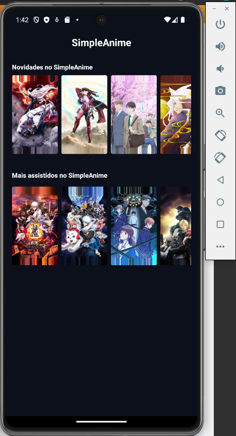
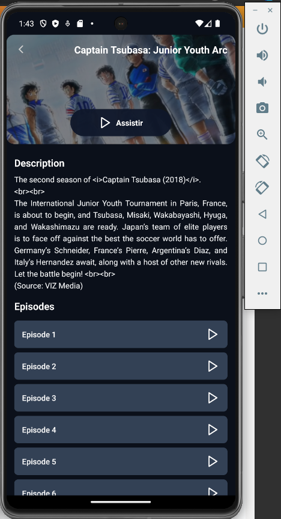
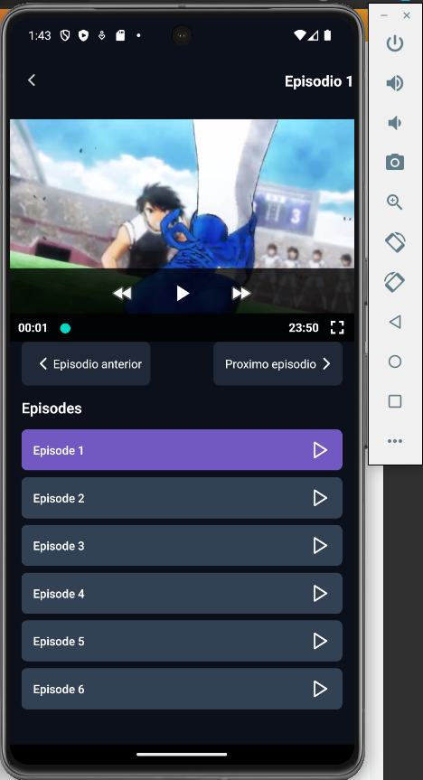

<div align="center">
  
</div>

<h3 align="center">
  SimpleAnime criado com React Native</a>.
</h3>


<p align="center">
  <a href="#tecnologias">Tecnologias</a> •
  <a href="#Como começar">Como começar</a> •
  <a href="#Suporte">Suporte</a> •
</p>


<div align="center">
  
</div>

<div align="center">
  
</div>

---

## Tecnologias

- React Native
- Expo
- Expo Router
- Typescript
- NativeWind
- Lucide React
- Tanstack Query

---

## Como começar

``` js
$ git clone https://github.com/melquisedeque-magalhaes/simpleanime
$ cd simpleanime
$ npm i
$ npm run start
```

a parti dai você escolhe o emulador ou seu próprio dispositivo físico para executar o projeto.
para executar no dispositivo físico e so scanear o qrcode.

---

## Suporte


<a href="https://www.buymeacoffee.com/melqui" target="_blank">
  
</a>

---

<p align="center">With 💜, by Melqui Sodré.</p>
